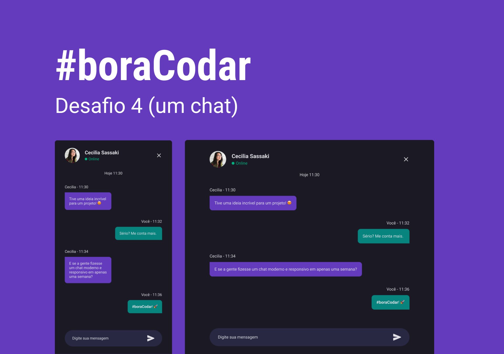

<h1 align="center"> Desafio 04 #boraCodar - Rocketseat  </h1>

 
 
    <a href="#-acesso-ao-projeto">Acesso ao projeto</a>&nbsp;&nbsp;&nbsp;|&nbsp;&nbsp;&nbsp; 
    <a href="#-tecnologias-utilizadas">Tecnologias utilizadas</a>&nbsp;&nbsp;&nbsp;|&nbsp;&nbsp;&nbsp;
    <a href="#-preview">Preview</a>&nbsp;&nbsp;&nbsp;|&nbsp;&nbsp;&nbsp;  
    <a href="#-links">Links</a> 
  

  
  
 
    
 
 
  
  
  
  ## 🖼️ Preview
  
  <h1 align="center">
  
  </h1>
  
  ## 📁 Acesso ao projeto
  
  Você pode acessar o [PROJETO](https://github.com/carlosalbertojusto/bora-codar-04-chatbox).
  
  ## ✔️ Tecnologias Utilizadas
  
 - ``Html`` 
 - ``CSS`` 
 - ``Git``
 - ``Figma``

## 🧾 Resumo do projeto

Desafio 04 #boraCodar da Rocketseat - Preview de um chatbox.

Live site URL : [Desafio 04 #boraCodar - Rocketseat ](https://carlosalbertojusto.github.io/bora-codar-04-chatbox/)

## 🔖 Layout

Você pode visualizar o layout do projeto através [DESSE LINK](https://www.figma.com/community/file/1200070743637495660). É necessário ter conta no [Figma](https://figma.com) para acessá-lo.
